# **<ins>SeqForge<ins/>**

## Design Philosophy:

SeqForge emphasizes clarity, flexibility, and scale. Each module is standalone but interoperable with others, allowing researchers to plug in just what they need or use the full pipeline. Designed for power users but accessible enough for those just entering the field, SeqForge aims to grow as the field of bacterial genomics and bioinformatics expands.

### **SeqForge is currently divided into three modules:**

### <ins>Module 1: Genome Search<ins/>

Purpose: Rapid database creation and high-throughput querying <br/>
*   makedb<br/>
    Create BLAST-compatible databases (makeblastdb) from a single FASTA file or an entire directory. Supports both nucleotide and protein databases, including gzipped inputs, with multiprocessing support to boost performance on large datasets.
*   query<br/>
    A parallelized BLAST wrapper that allows you to run a set of query sequences (nucleotide or protein) against one or many databases in batch.
    Includes:
    *   Support for blastn, tblastn, and blastp based on input types (auto-detected).
    *   Flexible input: single file or directory of FASTA files.
    *   Optional reporting of only strongest match per query.
    *   Automatic filtering based on identity, coverage and/or e-value thresholds.
    *   Output includes both full and filtered results tables, plus alignment files if desired.
    *   Motif mining for amino acid queries.
    *   Visualization of gene hits and sequence matches (hi-res PNG or PDF)
*   Motif support in query: <br/>
    When using blastp (amino acid query against protein database), users may specify an amino acid motif (e.g., WXWXIP) using the `--motif` flag. This performs a regex-based search across all BLAST hits,             independent from internally-curated or user-defined pident, query coverage, and e-value thresholds, ensuring detection of conserved motifs even in low-identity or heterologous alignments that might otherwise     be filtered out. This is particularly useful for detecting signature domains (e.g., catalytic triads, DNA-binding motifs) in diverse sequence families.
*   BLAST hits and motif matches may be visualized using the `--visualize` flag. BLAST hits across genomes are represented by heatmap, where the color intensity of each individual cell reflects that query's          percent identity within a specific genome. If `--visualize` is combined with `--motif`, motif matches will be illustrated as a sequence logo representing amino acid frequencies. The `--visualize` flag must       be run with `--report-strongest-matches`

SeqForge Module 1 automates the process of running *N* BLAST queries against *N* databases and organizing the results.
______________________________________________________________________________________________________________________________________
### <ins>Module 2: Sequence Investigation<ins/>

Purpose: Extract meaningful biological context from BLAST hits <br/>
*   extract <br/>
    Extract aligned sequences identified via the Genome Search Query pipeline from original FASTA files.
    Features:
    *   Optional translation of nucleotide hits to protein for full gene alignments.
        *    This should only be used with full gene alignments.
    *   Upstream/downstream padding for context-based analysis.
    *   Filtering using percent identity, query coverage, and/or e-value.
*   extract-contig<br/>
    Extract *entire contigs* from reference assemblies based on where BLAST hits occurred. Ideal for identifying genomic context of hits in metagenomic assemblies too large to open via a genome browser.
______________________________________________________________________________________________________________________________________
### <ins>Module 3: Utilities<ins/>

Purpose: General-use tools for various genomic workflows <br/>
*   sanitize<br/>
    *   Remove special characters from input files—**required** for all Genome Search analyses.
    *   Choose to rename files using `--in-place` (strongly recommended).
    *   Or copy files to a new directory and rename the copies, leaving the original files untouched.
*   split-fasta<br/>
    Split multi-FASTA files into smaller chunks for downstream processing.
    *   Choose fixed sequence count per chunk or split one sequence per file.
    *   Optionall compress output for storage/transfer efficiency.
*   search<br/>
    Extract isolation metadata from **GenBank** or **JSON** files.
    *   User-defined or comprehensive field extraction to CSV or TSV.
*   mask<br/>
    The mask module allows users to selectively **mask (redact)** sequences from FASTA files based on user-supplied kmers or unitigs. this is especially helpful when running kmer/unitig-based GWAS where repetitive or misleading sequences (i.e., assembly artifacts) can inflate associations.
    Features:
    *   Supports input as text (one sequence per line) or multi-FASTA (supports gzipped files).
    *   Options for soft masking (N), dash-masking (-), or randomized masking (-ATGC- scrambling, fsm-lite compatible).
    *   Designed for large FASTA datasets with multiprocessing support.
*   fasta-metrics<br/>
    Compute common assembly metrics from an input FASTA file or all FASTA files within a directory
    *   The following metrics are calculated
        *   Number of contigs
        *   Genome size (bp)
        *   Longest contig
        *   Shortest contig
        *   GC content (%)
        *   N count
        *   N50
        *   L50
        *   Lengths of each contig (CSV only)
______________________________________________________________________________________________________________________________________
______________________________________________________________________________________________________________________________________

## Recommended Workflow:

```mermaid
graph TD;
    Z{{FASTA}}-->A{Sanitize};
    A{Sanitize}-->B{{Database-Creation}};
    B{{Database-Creation}}-->C[Query];
    C[Query]-->D[Extract];
    C[Query]-->E[Extract-Contig];
    A{Sanitize}-->F[FASTA-Metrics];
    A{Sanitize}-->G[Mask];
    A{Sanitize}-->H[Split-FASTA];
    I[JSON/GenBank]-->J[Search];

    %% Custom style for Sanitize node
    style Z fill:#11d393,stroke:#fff5ee,stroke-width:4,font-size:30,color:#454545
    style A fill:#d48074,stroke:#fff5ee,stroke-width:3,font-size:26px
    style B fill:#d40078,stroke:#FCF5E5,stroke-width:2,font-size:22px
    style C fill:#920075,stroke:#333,stroke-width:1,font-size:18px
    style D fill:#650D89,stroke:#333,stroke-width:1,font-size:18px
    style E fill:#023788,stroke:#333,stroke-width:1,font-size:18px
    style F fill:#fd1d53,stroke:#333,stroke-width:1,font-size:18px
    style G fill:#fd3777,stroke:#333,stroke-width:1,font-size:18px
    style H fill:#2e2157,stroke:#333,stroke-width:1,font-size:18px
    style I fill:#11c9d3,stroke:#333,stroke-width:1,font-size:22px,color:#454545
    style J fill:#6e1515,stroke:#333,stroke-width:1,font-size:18px
```


______________________________________________________________________________________________________________________________________
**All pipelines** should start with a check for special characters in input FASTA file names. Special characters are defined as any 
character aside from a-z, A-Z, 0-9 and underscores. The BLAST+ architecture cannot parse anything but these; inclusion of special
characters in a filename (e.g., GCA_900638215.1.fna, the **non-extension period** is pipeline-breaking) will result in database creation failure.

To scan your FASTA population, simply run: `seqforge --sanitize -f /path/to/FASTA/file(s) -e fasta --dry-run`.
This will print any problematic filenames to the console without making changes. If changes are needed, re-run without `--dry-run` 
using either `--in-place` (recommended) or `--sanitize-outdir <dir>`. See Module 3: Utilities > seqforge sanitize for more details.

Periods, hyphens, colons, semicolons, and whitespace are replaced by '_'. Parenthesis and quotation marks are deleted. GCA_900638215.1.fna
(**non-compliant**) becomes GCA_900638215_1.fna (**compliant**).
______________________________________________________________________________________________________________________________________
**Suggested Workspace:** <br/>
For organization, we suggest generating individual directories for each data type prior to the start of any SeqForge module:

`cd /path/to/working/directory` <br/>
`mkdir -p FASTA DBs Query Results`, **where:**

**DBs:** Output directory to store BLAST databases generated via `seqforge makedb` <br/>
**FASTA:** Directory of genomes to parse, used to create BLAST databases <br/>
**Query:** Directory containing query file(s) to use with `seqforge query` <br/>
**Results:** Directory where Genome Search results will be stored

We additionally recommend generating output directories for any additional SeqForge modules used. 
______________________________________________________________________________________________________________________________________
______________________________________________________________________________________________________________________________________

**Author:** <br />
    Elijah R. Bring Horvath, PhD (https://github.com/ERBringHorvath)

**License:** <br />
    This program is shared under MIT License, which allows for modification and redistribution with attribution.

## Install NCBI BLAST+

**SeqForge uses [NCBI BLAST+](https://pubmed.ncbi.nlm.nih.gov/20003500/)**

Camancho C, Coulouris G, Avagyan V, Ma N, Papadopoulos J, Bealer K, Madden TL, **2009**. <br />
BLAST+: architecture and applications. *BMC Bioinformatics*, 10, 421. doi:10.1186/1471-2105-10-421

**Install BLAST+**

Download latest version of [BLAST+](https://ftp.ncbi.nlm.nih.gov/blast/executables/blast+/LATEST/)

Or using Conda:

1. Install Conda [miniforge](https://github.com/conda-forge/miniforge/) if not already installed

2. Create Conda environment

`conda create -n seqforge`

3. Activate Conda envrionment

`source activate seqforge`

4. Install BLAST+

`conda -y install bioconda::blast`

**Verify BLAST Installation**

`makeblastdb -h` <br />
`blastn -h`

If these commands run without error, BLAST is correctly installed. If an error occurs, refer to the [BLAST+ documentation](https://blast.ncbi.nlm.nih.gov/doc/blast-help/index.html#index)

## SeqForge Installation

If not already installed, install [Git](https://github.com/git-guides/install-git) <br />
* Linux/Unix systems should have this installed by default <br />
* To test installation, open the terminal and type `git --version` <br />
* For macOS users, you should see something like `git version 2.37.1 (Apple Git-137.1)`

## **Clone SeqForge from source**

We suggest installing SeqForge within your Home folder, such as `/Users/user/` 

Change directory to desired installation path

`cd /Users/user`

Clone SeqForge from the repository

`git clone https://github.com/ERBringHorvath/SeqForge`

Add SeqForge to your PATH

1. Open your profile in a text editor. This might be `~/.bash_profile` or `~/.zshrc`
2. Add the following line to the end of the file:

`export PATH=$PATH:/Users/user/seqforge/bin`

Replace `/Users/user/seqforge/bin` with the actual path to the directory containing the executable. <br />
Whatever the initial directory, this path should end with `/seqforge/bin`

Save the file and restart your terminal or run `source ~/.bashrc` or `~/.bash_profile` (Linux/Unix) or `source ~/.zshrc` (macOS)

**Install Dependencies**

`pip install -r requirements.txt` or `pip3 install -r requirements.txt`

**Verify SeqForge Installation**

`seqforge --module-health`

You should see: <br/>
```
Module Status Report:
 - makedb: Available
 - query: Available
 - split_fasta: Available
 - extract_sequences: Available
 - extract_contigs: Available
 - mask: Available
 - search: Available
 - sanitize: Available
 - fasta_metrics: Available
```
If there is a problem, the status will read 'Broken or Missing'.

Help menu and version: <br/>
`seqforge --help` <br />
`seqforge --version`

NOTE: Permissions should automatically be applied during installation. If you get a `permission denied` message when running `seqforge`
permissions may need to be changed manually. To do this, you can use the following command:

`chmod +x /path/to/seqforge/bin/seqforge`

______________________________________________________________________________________________________________________________________
______________________________________________________________________________________________________________________________________

# <ins>Module 1: Genome Search</ins>

**Building a BLAST+ Database Library**

seqforge makedb: <br />
`-f`, `--fasta-directory`: path to the directory containing input files in FASTA format <br />
`-o`, `--out`: path to directory where you want to store your databases <br/>
`-T`, `--threads`: number of cores to dedicate for multiprocessing <br/>
`-s`, `--sanitize`: remove pipeline-breaking special characters from file names <br/>

Example: <br />
`seqforge makedb -f /path/to/FASTA/files -o /path/to/results/folder -T 4`

**Database type is automatically detected during database creation** <br/>
.fasta, .fa, .fas, .ffn, .fna == nucleotide <br/>
.faa == protein 

**Querying a database library**

seqforge query: <br />
`-d`, `--database`: path to directory containing BLAST+ databases <br />
`-q`, `--query_files`: path to directory containing query files in amino acid FASTA format <br />
`-e`, `--evalue`: maximum e-value cutoff, default 0.00001 <br />
`-o`, `--output`: path to directory to store results
`-T`, `--threads`: number of cores to dedicate for multiprocessing <br />
`--report-strongest-match`: report only the single strongest match for each query <br />
`--min-perc`: define minimum percent identity threshold. Default = 90 <br />
`--min-cov`: define minimum query coverage threshold. Default = 75 <br />
`--nucleotide-query`: use blastn for queries in nucleotide FASTA format <br />
`--min-seq-len`: define minimum sequence length for short nucleotide sequence queries (use with caution and only with blastn) <br />
`--no-alignment-files`: suppress alignment file creation <br/>
`--keep-temp-files`: retain individual *_results.txt files in output directory <br/>
`--motif`: amino acid motif (e.g., WXWXIP) to search within blastp hits. X is treated as a wildcard. For use with blastp queryies <br/>
`-f`, `--fasta-directory`: path to FASTA file(s) used to create BLAST databases. Required if using `--motif` <br/>
`--visualize`: generate heatmap of BLAST hits and sequence logo of motif hits if `--motif` returns matches <br/>
`--pdf`: override PNG output of visualize and instead generated a PDF (use in combination with `--visualize`)

Basic example: <br />
`seqforge query -T 8 -d /path/to/blast/database/files -q /path/to/query/files/` <br /> 
`-o /path/to/results/folder`

Witch's Brew: <br/>
`seqforge query -T 8 \` <br/>
`-d /path/to/blast/databases \` <br/>
`-q /path/to/query/files \` <br/>
`-o /path/to/results/directory \` <br/>
`--min-perc 75` `--min-cov 70 --evalue 0.001 \` <br/>
`--report-strongest-matches \` <br/>
`--motif WXWXIP -f /path/to/FASTA/files \` <br/>
`--visualize`

All Genome Search results are concatenated to `all_results.csv` and either `all_filtered_results.csv` or <br /> 
`filtered_results.csv` within the output folder designated by `-o, --output`

Plots are saved to the current working directory. Tabulated motif hits are saved in the results directory as `motif_matches.csv`

______________________________________________________________________________________________________________________________________
______________________________________________________________________________________________________________________________________

# <ins>Module 2: Sequence Investigation</ins>

## Extract Sequences from a SeqForge Query

seqforge extract: <br />
`-c`, `--csv-oath`: path to results csv file from `seqforge query` <br />
`-f`, `--fasta_directory`: path to reference FASTA assemblies <br />
&nbsp;&nbsp;&nbsp;&nbsp;These should be the FASTA files the BLAST databases were created from and should have the same basename as the query results files <br />
`-o`, `--output_fasta`: output file to contain sequences, defaults to current working directory <br />
`-T`, `--threads`: number of cores to dedicate for multiprocessing <br />
`--evalue`: maximum e-value threshold, default = 0.00001 <br />
`--min-perc`: minimum percent identity threshold. Default = 90 <br />
`--min-cov`: minimum query coverage threshold. Default = 75 <br />
`--translate`: translates extracted nucleotide sequence(s) <br/>
`--up`: extract additional basepairs upstream of aligned sequence <br/>
`--down`: extract additional basepairs downstream of aligned sequence

**NOTE:** Translation of sequences is optional, however care should be used when translating extracted nucleotide sequences, as BLAST results may not always contain a full CDS. To allow for this, when the `--translate` argument is called, extracted sequences will be trimmed to only include complete codons, which may affect interpretation of results.

**NOTE:** `--up` and `--down` flags are incompatible with `--translate`, as 6-frame translation is not currenlty supported.

**NOTE:** Results files and FASTA reference assemblies <ins>**must**</ins> share the same basename:

Example basename: 'FILE' <br />
&nbsp;&nbsp;&nbsp;&nbsp;Example FASTA: FILE.fasta <br />
&nbsp;&nbsp;&nbsp;&nbsp;Example results file: FILE_results.txt

If SeqForge is used for database creation and queries, matching basenames should be generated automatically

**Example usage:** <br />
`seqforge extract -c /path/to/results/file -f /path/to/reference/FASTA/files -T 8 -o sequences.fa`

**Witch's Brew:** <br/>
`seqforge extract -T 8 \` <br/>
`-c /path/to/results/file -f /path/to/reference/FASTA/files \` <br/>
`-o sequences.fa` <br/>
`--min-perc 75 --min-cov 70 --evalue 0.001 \` <br/>
`--up 1200 --down 1200`

**NOTE:** <br />
Results file needs to be `all_results.csv`, `all_filtered_results.csv`, or `filtered_results.csv`, which are automatically generated using `seqforge query`

If percent identity and query coverage were set manually during `seqforge query`, these values will need to be reflected when using `mutliblast extract` using `--min-perc` and/or `--min-cov` <br />
For instance, if `seqforge query` was called using `--perc 75`, but the `seqforge extract` minimum percent identity is left at its default value (90), the appropriate sequences may not be extracted, as they may fall beneath the internally curated `--min-perc` theshold. 

`seqforge extract` will generate a multi-FASTA file of all sequences identified by `seqforge queryP`/`query` based on the default or user-defined e-value cutoff.

## Extract Entire Contig ##

seqforge extract-contig: <br />
`-c`, `--csv-path`: path to csv results file from `seqforge query` <br />
`-f`, `--fasta_directory`: path to reference FASTA assemblies <br />
&nbsp;&nbsp;&nbsp;&nbsp;These should be the FASTA files the BLAST databases were created from and should have the same basename as the query results files <br />
`-o`, `--output_fasta`: output file to contain sequences, defaults to current working directory <br />
`-T`, `--threads`: number of cores to dedicate, default is 1 <br />
`--evalue`: maximum e-value threshold, default = 0.00001 <br />
`--min-perc`: minimum percent identity threshold. Default = 90 <br />
`--min-cov`: minimum query coverage threshold. Default = 75 <br />

**NOTE:** Results files and FASTA reference assemblies <ins>**must**</ins> share the same basename for both `seqforge extract` and `seqforge extract-contig`:

Example basename: 'FILE' <br />
&nbsp;&nbsp;&nbsp;&nbsp;Example FASTA: FILE.fasta <br />
&nbsp;&nbsp;&nbsp;&nbsp;Example results file: FILE_results.txt

If SeqForge is used for database creation and queries, matching basenames are handled automatically

**Example usage:** <br />
`seqforge extract-contig -d /path/to/results/files -f /path/to/reference/FASTA/files -T 8 -o contigs.fa`

`seqforge extract-contig` will generate a multi-FASTA file of all contigs harboring a matching <br /> 
sequence identified by `seqforge query` based on the default or user-defined thresholds. 

This program was designed for use with metagenome mining, as metagenomic assemblies are often too large to explore using a genome browser. If short-read assembly methods are used, contigs harboring genes of interest may be extracted; contigs will likely be more tractible to parsing using a genome browser if manual annotation is needed. 

______________________________________________________________________________________________________________________________________
______________________________________________________________________________________________________________________________________

# <ins>Module 3: Utilties<ins/>

## Sanitize File Names

seqforge sanitize: <br/>
`-i`, `--input`: FASTA file or directory of FASTA files to be cleaned
`-e`, `--extension`: extention of files to sanitize; for all standard FASTA formats, simply pass `-e fasta` <br/>
`-I`, `--in-place`: overwrite problematic file names with names containing no special  characters (recommended) <br/>
`-S`, `--sanitize-outdir`: path to new directory for files. This option copies file(s) to a new directory and removes special characters from <br/>
        the copied file names, leaving the original file names intact (storage intensive) <br/>
`--dry-run`: preview changes without committing <br/>

## FASTA File Metrics

seqforge fasta-metrics: <br/>
`-f`, `--fasta-directory`: path to FASTA file or directory of FASTA files to be analyzed <br/>
`-o`, `--output`: optional name for CSV summary (default: fasta_metrics_summary.csv) <br/>

## Split Multi-FASTA files

seqforge split-fasta: <br />
`-i`, `--input`: input multi-FASTA file <br />
`-o`, `--output-dir`: output directory for split FASTA files <br />
`--fragment`: split multi-FASTA file into defined <int> of sequences each <br />
`--compress`: compress output files as .gz <br />

## Mask Unitig/Kmer Sequences 

seqforge mask: <br />
`-i`, `--input-dir`: path to FASTA files to be masked <br />
`-o`, `--output-dir`: output directory for masked FASTA files <br />
`-s`, `--sequence-files`: text or FASTA file of unitigs/kmers to mask (can be gzipped) <br />
`-T`, `--threads`: number of threads to use for masking <br />
`-v`, `--verbose`: print detailed match information <br />
`--dash`: use '-' instead of 'N' (default) for masking <br />
`--scramble`: mask as -[ATGC]- (random string of ATGC flanked by dashes, fsm-lite compatible <br />
`--dry-run`: preview run without making changes <br />

seqforge mask was designed to mask noisy sequences from GWAS kmer-association analyses. 'Noise' might be overrepresented sequences, sequencing/assembly artifacts, etc.

**Example Usage:** <br />
`seqforge mask -i /path/to/genome/FASTA/files -o /path/to/output/dir -s kmers.txt -T 8 -v --dash`

## Extract Sequence Metadata from JSON/GenBank Files

seqforge search: <br/>
`-i`, `--input`: input file (.json or .gb/.gbk)<br/>
`-o`, `--output`: output file (e.g., .csv, .tsv, .json) <br/>
`--all`: extract all available metadata <br/>
`--fields`: space-separated list of metadata fields to extract <br/>
Optional fields:
    accession, organism, strain, isolation_source, host, region, lat_lon, collection_date, <br/> 
    collected_by, tax_id, comment, keywords, sequencing_tech, release_date

**Example usage:** <br/>
`seqforge search -i /path/to/input.(json | gbk) -o metadata.csv --fields accession isolation_source host region`
______________________________________________________________________________________________________________________________________
______________________________________________________________________________________________________________________________________

# Citations

Cite SeqForge: <br />
SeqForge (https://github.com/ERBringHorvath/SeqForge)

Cite NCBI BLAST+: <br />
Camancho C, Coulouris G, Avagyan V, Ma N, Papadopoulos J, Bealer K, Madden TL, **2009**. <br />
BLAST+: architecture and applications. *BMC Bioinformatics*, 10, 421. doi:10.1186/1471-2105-10-421
